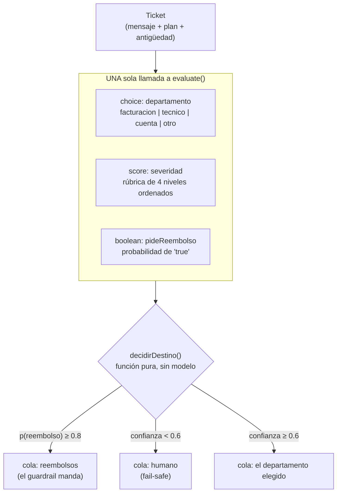

# Patrón Agéntico: Routing con un modelo de evaluación (Jev)

> Ubicación del código: [`routing-jev.ts`](./routing-jev.ts)

En esta sección probamos un tipo de modelo distinto a todos los demás del repo:
**Jev** (`typesafe-ai/jev`, de TypeSafe AI), un *modelo de evaluación*. No
escribe texto: responde preguntas tipadas y devuelve decisiones con su
probabilidad. Lo usamos para implementar el patrón **Routing** — clasificar una
petición y despacharla al handler correcto — y veremos por qué un LLM
generalista hace ese trabajo peor.

### Temas puntuales

- Modelos de generación vs. modelos de evaluación.
- La función `experimental_evaluate` del AI SDK.
- Vercel AI Gateway y `gateway.evaluationModel()`.
- Los tres tipos de pregunta: `choice`, `score` y `boolean`.
- Probabilidades como medida de confianza, y umbrales de decisión.
- Enrutar con código determinista a partir de una clasificación.
- Guardrails: cuándo una regla debe pasar por encima del clasificador.

## ¿Qué problema resuelve?

Antes de responderle a alguien hay que decidir **quién** responde. En una mesa
de soporte eso significa: ¿esto es facturación, un fallo técnico o un problema
de acceso? ¿es urgente? ¿el cliente está pidiendo su dinero de vuelta?

La tentación es resolverlo con el LLM que ya tenemos: *"clasifícame este
ticket"*. El problema es que un modelo de generación responde **en prosa**, y
eso trae tres defectos:

1. **Puede salirse del enum.** Le damos cuatro categorías y devuelve
   `"facturación/soporte"`, `"Billing"`, o una frase completa. Nada en el
   contrato se lo impide; solo se lo pedimos amablemente en el prompt.
2. **No expresa duda.** Un ticket ambiguo y uno obvio producen la misma
   respuesta seca. No hay forma de saber cuándo escalar a un humano.
3. **Una pregunta por llamada.** Categoría, urgencia y "¿pide reembolso?" son
   tres viajes al modelo, o un JSON que hay que validar a mano.

El patrón **Routing** con un modelo de evaluación ataca las tres cosas: la
elección viene garantizada dentro del conjunto declarado, acompañada de una
distribución de probabilidad, y todas las preguntas viajan en una sola petición.

## Jev: qué es y qué NO es

| | |
|---|---|
| **Qué es** | Un modelo de evaluación: recibe un *estado* y preguntas tipadas, devuelve `choice` / `score` / `probability`. |
| **Qué NO es** | Un modelo de chat. No redacta la respuesta al cliente, no resume, no razona en voz alta. |
| **Model ID** | `typesafe-ai/jev` (vía Vercel AI Gateway) |
| **Ventana de contexto** | 32.000 tokens |
| **Precio** | ~$0.042 por millón de tokens de entrada |
| **Capacidades** | `choice`, `score`, `boolean` (comprobable con `model.supportedQuestionTypes`) |

La consecuencia práctica: Jev **no reemplaza** a tu modelo generativo, lo
complementa. Uno decide a dónde va el ticket; el otro escribe la respuesta.

## Idea central



Lo importante del diagrama: **el modelo clasifica, el código decide**. Los
umbrales viven en TypeScript, a la vista, y se pueden testear sin llamar a
ninguna API.

## Ejemplo en este archivo

`routing-jev.ts` enruta cuatro tickets de una mesa de soporte, con dos
estrategias:

- **A) `sinRouterTipado()`** — le pide la categoría al modelo local de Ollama
  con `generateText`. Después un **juez programático** comprueba si la respuesta
  está dentro del enum (`Object.keys(DEPARTAMENTOS).includes(...)`) y cuenta los
  fallos en `fueraDeEnum`. No preguntamos al modelo si acertó: lo verificamos.
- **B) `conJev()`** — una llamada `evaluate()` por ticket, con las tres
  preguntas juntas, y después `decidirDestino()` aplica los umbrales.

Los tickets están elegidos a propósito: `t-03` es genuinamente ambiguo (¿es un
problema de cuenta o un fallo técnico?) y `t-04` mezcla un fallo de plataforma
con una exigencia de devolución. Son los dos casos donde se nota la diferencia.

> **Nota honesta sobre el baseline:** que el modelo generalista se salga del
> enum es *probable*, no seguro. En algunas corridas acierta las cuatro. Lo que
> nunca puede darte es la confianza ni la severidad en la misma llamada: por eso
> la columna `conConfianza` de la rama A es `0` por construcción, no por mala
> suerte.

## Anatomía de una pregunta

Las tres preguntas comparten el campo `instructions` y se diferencian en
`criteria`:

```ts
{
  departamento: {
    type: 'choice',
    instructions: '¿Qué equipo debe atender este ticket?',
    criteria: { facturacion: 'Cobros...', tecnico: 'Fallos...' },  // mapa opción → descripción
  },
  severidad: {
    type: 'score',
    instructions: '¿Qué tan grave es la situación?',
    criteria: ['Consulta', 'Molesto', 'Bloqueado', 'Bloqueado con dinero'], // ≥2 niveles ORDENADOS
  },
  pideReembolso: {
    type: 'boolean',
    instructions: '¿El cliente pide que le devuelvan su dinero?',
    criteria: { true: '...', false: '...' },   // opcional
  },
}
```

| Tipo | `criteria` | Respuesta |
|---|---|---|
| `choice` | Mapa no vacío de opción → descripción | `choice`: una de las claves (tipada como unión literal) + `probabilities?` |
| `score` | Array de ≥2 niveles ordenados, índice 0 = el más bajo | `score`: número **fraccional** en `[0, niveles-1]` + `probabilities?` |
| `boolean` | Descripciones opcionales de `true` y `false` | `probability`: número `0..1`, **siempre presente** |

Detalles que importan:

- `instructions` y las descripciones pueden ser string, objeto JSON o array.
- El `state` es **uno solo y compartido** por todas las preguntas. Un array como
  estado es *un* estado, no un lote de entradas independientes.
- Todas las preguntas van en **una sola petición** al modelo.
- El `as const` de `DEPARTAMENTOS` en el código no es decorativo: gracias a él
  `answers.departamento.choice` queda tipado como
  `'facturacion' | 'tecnico' | 'cuenta' | 'otro'` en vez de `string`.

## Probabilidades, confianza y umbrales

Aquí hay tres sutilezas que se prestan a confusión:

1. **La probabilidad del `boolean` no es confianza.** `0.98` significa "muy
   probablemente sí" y `0.02` significa "muy probablemente no". Ambas son
   respuestas *seguras*. Lo incierto es el `0.5`.
2. **Las distribuciones de `choice` y `score` son opcionales.** Puede que
   `probabilities` venga `undefined`. Por eso el código usa `?.` y un
   `?? 0` que, al dejar la confianza en cero, manda el ticket a un humano:
   ante la duda, escalar de más.
3. **El SDK no promete calibración entre proveedores.** Los umbrales (`0.6`,
   `0.8`, `2.5` en este ejemplo) son decisiones de tu aplicación, no verdades
   universales. Ajústalos con datos reales.

```ts
const confianza = departamento.probabilities?.[departamento.choice] ?? 0;
```

El `score` merece una nota aparte: es **fraccional**, y cuando hay distribución
equivale a la media ponderada por probabilidad. Un `2.4` sobre una rúbrica de
4 niveles no es "nivel 2", es "entre el 2 y el 3, más cerca del 2".

## El enrutamiento real

`decidirDestino()` es una **función pura**: no llama a ningún modelo, solo lee
las respuestas. El orden de las reglas es deliberado:

```ts
if (pideReembolso.probability >= 0.8) → cola 'reembolsos'   // 1. guardrail
if (confianza < 0.6)                  → cola 'humano'       // 2. fail-safe
else                                  → cola departamento.choice
```

El guardrail va **primero** a propósito: en `t-04` el cliente reporta un fallo
técnico *y* exige su dinero. Un router que solo mirara la categoría lo mandaría
a soporte técnico y la exigencia de devolución se perdería por el camino. La
regla de negocio pasa por encima de la clasificación.

La severidad, en cambio, no cambia la cola: cambia la **prioridad** dentro de
ella.

## Requisitos previos

1. **Versiones del SDK.** `gateway.evaluationModel()` sólo existe desde
   `@ai-sdk/gateway@4.0.92`, que trae `ai@7.0.114`:
   ```bash
   pnpm add ai@^7.0.114 @ai-sdk/gateway@^4.0.92
   ```
2. **La API key del Gateway** en `.env`, con el nombre exacto que espera el SDK:
   ```
   AI_GATEWAY_API_KEY=vck_XXXXXX
   ```
3. **Un método de pago en tu cuenta de Vercel.** El AI Gateway devuelve
   `403 customer_verification_required` y rechaza las peticiones hasta que haya
   una tarjeta registrada — **incluso para consumir los créditos gratuitos**.
   Si falta, verás el aviso en rojo que imprime `jevMain()`.

## Cómo correr el ejemplo

En `src/main.ts`, deja descomentada únicamente la línea del patrón:

```ts
await jevMain();
```

Y ejecuta:

```bash
pnpm run dev
```

Salida esperada: los cuatro tickets clasificados por el modelo local (rama A,
con los pasos del tracer), luego los mismos cuatro con Jev mostrando
departamento, confianza, urgencia y probabilidad de reembolso más la cola
asignada (rama B), y al final el `console.table` comparativo.

Si el Gateway falla, la rama B se salta con un aviso y **el laboratorio sigue
corriendo**: la tabla se imprime solo con la fila del baseline.

## Resultados de una corrida real

Esta es la salida de Jev sobre los cuatro tickets (rama B). Los números vienen
de una ejecución real, no de un ejemplo inventado — úsalos para entender qué
devuelve el modelo antes de lanzarlo tú:

| Ticket | `departamento.choice` | confianza | `severidad.score` | `pideReembolso.probability` | Cola final | Prioridad |
|---|---|---|---|---|---|---|
| t-01 | `facturacion` | 100% | 2.11 / 3 | 28% | facturacion | normal |
| t-02 | `tecnico` | 100% | 2.59 / 3 | 4% | tecnico | **alta** |
| t-03 | `cuenta` | 98% | 2.11 / 3 | 2% | cuenta | normal |
| t-04 | `facturacion` | 76% | 2.99 / 3 | **98%** | **reembolsos** | **alta** |

Comparativa final:

```
┌───────────────────┬───────┬─────────────┬─────────────┬──────────────┐
│ (index)           │ steps │ totalTokens │ fueraDeEnum │ conConfianza │
├───────────────────┼───────┼─────────────┼─────────────┼──────────────┤
│ Sin router tipado │ 4     │ 1700        │ 0           │ 0            │
│ Con Jev           │ 4     │ 2836        │ 0           │ 4            │
└───────────────────┴───────┴─────────────┴─────────────┴──────────────┘
```

### Qué mirar en estos números

**1. El guardrail en acción (t-04).** Es el caso más instructivo. El cliente
reporta un fallo de plataforma, y Jev clasifica el ticket como `facturacion`
con apenas 76% de confianza — el ticket es genuinamente mixto. Pero la pregunta
booleana le da **98%** a "pide su dinero de vuelta", así que `decidirDestino()`
lo manda a la cola de `reembolsos` por encima de la clasificación. Un router que
solo mirara la categoría habría perdido la exigencia de devolución.

**2. La confianza discrimina de verdad.** Los casos obvios (t-01, t-02) salen
al 100%; el ambiguo (t-04) baja a 76%. Esa señal es exactamente lo que no
existe cuando pides la categoría en prosa. Si bajaras el umbral
`UMBRAL_CONFIANZA` a `0.8`, t-04 se iría a revisión humana en vez de a una cola
automática — pruébalo, es un cambio de una línea.

**3. El `score` es fraccional, no un entero.** `2.11` y `2.99` sobre una rúbrica
de 4 niveles (índices 0–3) no son "nivel 2": son posiciones *entre* niveles. El
`2.99` de t-04 está prácticamente en el nivel 3 ("bloqueado y además con dinero
de por medio"), lo que activa la prioridad alta; el `2.11` de t-01 apenas roza
el nivel 2. Por eso el umbral de urgencia es `2.5` y no `>= 2`.

**4. Jev gasta más tokens, pero resuelve más.** 2836 vs 1700 tokens parece peor
hasta que cuentas qué entregó cada rama: el baseline dio **una** categoría por
ticket; Jev dio categoría + confianza + severidad + guardrail **en una sola
llamada**. Para igualarlo, el baseline necesitaría tres llamadas por ticket, y
aun así no tendría probabilidades.

**5. `fueraDeEnum: 0` en ambas ramas — y no significan lo mismo.** En Jev es
`0` **por construcción**: el tipo `choice` no puede devolver otra cosa. En el
baseline fue `0` **por suerte en esta corrida**; el modelo local se portó bien.
Ejecuta varias veces o cambia el modelo en `helpers/selected-model.ts` y verás
aparecer respuestas con puntuación, mayúsculas o frases completas. Esa
diferencia — garantía vs. suerte — es el punto central del patrón.

## Buenas prácticas que ejemplifica este código

| Práctica | Dónde se ve | Por qué importa |
|---|---|---|
| Separar clasificar de decidir | `decidirDestino()` no llama al modelo | Los umbrales quedan a la vista, versionados y testeables sin red |
| Fail-safe hacia el humano | `?? 0` en la confianza | Si el proveedor no manda distribución, escalamos en vez de adivinar |
| El guardrail por encima del router | `pideReembolso` se evalúa primero | Una regla de negocio no puede depender de que el clasificador acierte |
| Una taxonomía compartida | `DEPARTAMENTOS` y `SEVERIDAD` usados por A y B | La comparación es justa: ambas ramas ven las mismas opciones |
| Verificación determinista del baseline | `includes(respuesta)` en la rama A | No le preguntamos al modelo si acertó; lo comprobamos con código |
| Aislar la dependencia del Gateway | La instancia `jev` vive en `routing-jev.ts` | Si estuviera en `helpers/`, los patrones 01–03 exigirían la API key |
| Degradar sin tumbar el proceso | `try/catch` en `jevMain()` | Un fallo de red o de facturación no debe borrar el trabajo ya hecho |

## Preguntas y respuestas (autoevaluación)

**1. ¿Cuál es la diferencia esencial entre un modelo de generación y uno de
evaluación?**

El de generación produce texto libre: hay que parsearlo y validarlo, y nada
garantiza su forma. El de evaluación responde preguntas tipadas contra un
estado y devuelve valores que ya cumplen un contrato (una de las opciones
declaradas, un número dentro de la rúbrica, una probabilidad). Jev pertenece al
segundo grupo.

**2. ¿Por qué el tipo `choice` no puede devolver una categoría inventada?**

Porque la respuesta se define como una de las claves del mapa `criteria`. No es
una sugerencia dentro del prompt, es el contrato del tipo de pregunta; y con
`as const` TypeScript incluso lo refleja como unión literal en tiempo de
compilación.

**3. Si `probabilities` puede venir `undefined`, ¿por qué el código no lanza un
error?**

Porque la especificación las declara opcionales para `choice` y `score`. El
código usa `?? 0`, lo que deja la confianza en cero y hace que el ticket caiga
a revisión humana. Es un fail-safe deliberado: preferimos escalar de más antes
que enrutar a ciegas.

**4. La probabilidad de una pregunta booleana es 0.03. ¿Significa que el modelo
está inseguro?**

No. Significa "muy probablemente **no**". La probabilidad booleana mide la
probabilidad de que la respuesta sea verdadera, no la confianza del modelo. La
incertidumbre estaría cerca de `0.5`.

**5. ¿Por qué el guardrail de reembolso se evalúa antes que la confianza y que
la categoría?**

Porque es una regla de negocio que no debe depender de que el clasificador
acierte. Un ticket puede ser legítimamente "técnico" y aun así contener una
exigencia de devolución que la empresa está obligada a atender por otra vía.

**6. ¿Qué ventaja tiene mandar las tres preguntas en una sola llamada?**

Comparten el mismo estado y el mismo coste de entrada: se paga una vez por el
contexto en lugar de tres. Además llegan respuestas coherentes entre sí,
evaluadas sobre exactamente la misma información.

**7. ¿Por qué la instancia del modelo Jev no se declaró en
`helpers/selected-model.ts` como los demás?**

Porque `helpers/index.ts` re-exporta con `export *`: cualquier símbolo de ese
barrel se evalúa al importar *cualquier* patrón, y los patrones 01–03 pasarían a
requerir `AI_GATEWAY_API_KEY` sin usarla. Además un `EvaluationModel` no es
intercambiable con un `LanguageModel`, así que tampoco podría reutilizar la
variable `model`.

## Errores comunes a evitar

- **Usar las versiones viejas del SDK.** Antes de `@ai-sdk/gateway@4.0.92` no
  existe `evaluationModel()`, y `ai@7.0.103` documenta explícitamente que los
  IDs de modelo como string *"no están soportados todavía"*. El ejemplo de la
  web de Vercel que pasa `model: 'typesafe-ai/jev'` falla en esas versiones.
- **Confundir la probabilidad booleana con confianza** (ver pregunta 4).
- **Asumir que `probabilities` siempre llega.** Es opcional; usa `?.` y define
  qué pasa cuando falta.
- **Asumir que `usage.totalTokens` siempre llega.** Sólo está disponible cuando
  el proveedor reporta tokens de entrada *y* de salida; de ahí el `?? 0`.
- **Poner los umbrales dentro del prompt** en vez de en el código. El valor de
  este patrón es justamente que la decisión sea determinista y auditable.
- **Olvidar que la API es `experimental_`.** `experimental_evaluate` y la
  especificación del modelo de evaluación pueden cambiar **incluso en versiones
  patch**. Fija las versiones si te importa la estabilidad.
- **Pedirle prosa a Jev.** No es su trabajo. Si necesitas redactarle la
  respuesta al cliente, encadena un modelo generativo después del enrutamiento.
