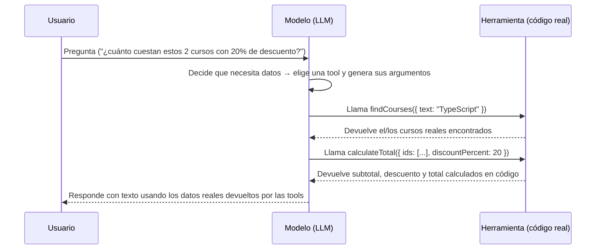

# Patrón Agéntico: Tool Use (Uso de Herramientas)

> Ubicación del código: [`tool-use.ts`](./tool-use.ts)

En esta sección comenzamos con nuestro primer patrón agéntico, **"Tool
Use"**: primero vemos cómo el modelo falla estrepitosamente al intentar
responder sin datos reales, y luego le damos herramientas que lo ayudan a
resolver el problema de forma confiable.

### Temas puntuales

- Funciones para generar texto (`generateText`).
- Modelos pensantes y no pensantes.
- Creación de herramientas y funciones (`tool`, `inputSchema`, `execute`).
- Buscar cursos (`findCourses`).
- Calcular montos (`calculateTotal`).
- Crear agentes con instrucciones específicas (`instructions` + `tools` +
  `stopWhen`) que combinan todas las ideas anteriores.

## ¿Qué problema resuelve?

Un modelo de lenguaje (LLM) solo "sabe" lo que vio durante su entrenamiento.
No tiene acceso a:

- Datos privados de tu negocio (catálogos, precios, inventario, usuarios).
- Información que cambia con el tiempo (stock, tipo de cambio, fecha actual).
- Operaciones que requieren exactitud (cálculos matemáticos, consultas a una API).

Cuando le pides algo que depende de esos datos, el modelo tiene dos
comportamientos posibles y ambos son malos:

1. **Alucina**: inventa una respuesta plausible pero falsa, con total confianza.
2. **No hace nada útil**: responde de forma genérica o se niega a contestar.

El patrón **Tool Use** resuelve esto dándole al modelo la capacidad de
**llamar funciones reales** (herramientas) que consultan datos verdaderos o
ejecutan lógica determinista, en lugar de "adivinar".

## `generateText`: la función para generar texto

Todo el patrón se apoya en `generateText` (de `ai`, el Vercel AI SDK). Es la
función que envía un prompt (y, opcionalmente, herramientas) al modelo y
**espera la respuesta completa** antes de devolverla (a diferencia de
`streamText`, que va entregando el texto token a token). En este archivo se
usa dos veces:

- En `withoutTools()`: una sola llamada, sin `tools`, por lo que siempre
  genera exactamente 1 "step".
- En `withTools()`: con `tools` y `stopWhen`, por lo que puede generar
  varios "steps" internos (pensar → llamar herramienta → leer resultado →
  ...) hasta que el modelo decide responder con texto final.

`generateText` acepta, entre otras, estas opciones usadas aquí:

| Opción | Para qué sirve |
|---|---|
| `model` | Qué modelo de lenguaje usar (ver `model` en `src/helpers/selected-model.ts`) |
| `prompt` | El mensaje del usuario |
| `instructions` | El "system prompt": quién es el agente y qué reglas debe seguir |
| `tools` | El mapa de herramientas disponibles para que el modelo las invoque |
| `stopWhen` | La condición de parada (Circuit Breaker) |
| `onStepEnd` | Callback que se dispara al terminar cada step (lo usa el `tracer`) |

## Modelos pensantes y no pensantes

El modelo concreto a usar se centraliza en
[`src/helpers/selected-model.ts`](../../helpers/selected-model.ts), donde
hay varias opciones comentadas (Groq, Anthropic, OpenAI, Gemini, Ollama).
Esto es útil para entender una distinción importante a la hora de elegir
modelo para un agente con herramientas:

- **Modelos "no pensantes" (non-reasoning)**: responden directamente, sin un
  paso explícito de razonamiento interno antes de decidir la respuesta o la
  llamada a una herramienta. Suelen ser más rápidos y baratos (ej.
  `gpt-5-mini`, `gemini-2.5-flash`, `claude-haiku-4-5`).
- **Modelos "pensantes" (reasoning)**: generan un razonamiento interno
  (cadena de pensamiento) antes de responder o de decidir qué herramienta
  llamar y con qué argumentos. Suelen acertar mejor en tareas con varios
  pasos (como encadenar `findCourses` → `calculateTotal`), a costa de más
  tokens/latencia. El modelo usado por defecto en este proyecto,
  `ollama('gpt-oss:20b')`, es un modelo de este tipo (`gpt-oss`, *open
  source* y con capacidad de razonamiento).

Para un patrón como Tool Use, donde el modelo debe decidir **cuándo** llamar
una herramienta, **cuál** usar y **con qué argumentos** (y a veces
encadenar varias), un modelo pensante tiende a ser más confiable en tareas
con múltiples pasos, mientras que uno no pensante puede ser suficiente para
casos de una sola herramienta y argumentos simples.

## Idea central

El LLM nunca ejecuta código directamente. El flujo es:



El modelo **decide** cuándo llamar una herramienta y con qué argumentos,
pero **el código es quien ejecuta** la lógica y devuelve datos verificables.
El resultado se agrega de vuelta al historial de la conversación para que el
modelo lo use al redactar su respuesta final.

## Ejemplo en este archivo

`tool-use.ts` compara dos escenarios con la misma pregunta:

```ts
const QUESTION = `¿Cuánto costaria juntos el curso de TypeScript y el de Docker con un 20% de descuento?
                Dame tambien las horas totales.`;
```

- **`withoutTools()`**: le hace la pregunta al modelo tal cual, sin tools.
  El modelo no conoce el catálogo real de DevTalles, así que lo más probable
  es que invente precios, horas o incluso nombres de cursos.
- **`withTools()`**: le da al modelo dos herramientas (`findCourses` y
  `calculateTotal`) y unas instrucciones explícitas de no inventar datos.
  El modelo busca los cursos reales, delega el cálculo aritmético al código,
  y responde con números verificables.

`toolUseMain()` ejecuta el caso "con herramientas" (el caso "sin
herramientas" queda comentado, pero se puede activar para comparar ambos
resultados lado a lado con `console.table`).

### Las dos herramientas del agente

El agente de `withTools()` recibe exactamente dos herramientas, cada una
resolviendo una parte distinta del problema:

- **`findCourses`** — *Buscar cursos*: dado un `text` y/o `level`
  (ambos opcionales), filtra `COURSE_CATALOG` y devuelve los cursos que
  coinciden. Es la forma en que el modelo obtiene datos reales (id, precio,
  horas) en lugar de inventarlos.
- **`calculateTotal`** — *Calcular montos*: dado un arreglo de `ids` y un
  `discountPercent`, busca esos cursos, suma sus precios (`subtotal`),
  aplica el descuento y devuelve `subtotal`, `discount`, `total` y los
  `notFound` (ids que no existen en el catálogo). Es la forma en que el
  modelo delega la aritmética a código determinista.

En la práctica, para responder la `QUESTION` de este archivo el modelo
normalmente encadena ambas: primero llama `findCourses` (una o dos veces,
para ubicar el curso de TypeScript y el de Docker), y luego llama
`calculateTotal` con los `id` obtenidos y `discountPercent: 20`.

## Anatomía de una herramienta (`tool(...)`)

Cada herramienta declarada con `tool()` (del paquete `ai`) tiene 3 partes:

```ts
const findCourses = tool({
  description: '...',      // 1. Para qué sirve y cuándo usarla
  inputSchema: z.object({  // 2. Qué argumentos necesita y de qué tipo
    text: z.string().optional().describe('...'),
  }),
  execute: async (args) => {  // 3. La lógica real que se ejecuta
    // ...
    return { /* resultado */ };
  },
});
```

1. **`description`**: no es un comentario para humanos, es el texto que **el
   modelo lee** para decidir si esta herramienta es relevante para la
   pregunta actual. Debe ser clara y, si es necesario, prescriptiva
   ("Utilízala siempre antes de responder preguntas sobre precios").
2. **`inputSchema`** (con [Zod](https://zod.dev)): define la forma exacta que
   deben tener los argumentos. El SDK usa este esquema para:
   - Generar el "contrato" que el modelo debe seguir al construir la llamada.
   - Validar en runtime lo que el modelo generó, antes de ejecutar `execute`.
   Cada campo puede llevar `.describe('...')` para explicarle al modelo qué
   se espera ahí (ej. formato de un ID, unidades de un número, etc.).
3. **`execute`**: la función real (puede ser async: llamar a una BD, una API,
   el sistema de archivos, etc.). Recibe los argumentos ya tipados y
   validados. Aquí, y solo aquí, ocurre el trabajo determinista.

## Crear el agente: instrucciones + herramientas + Circuit Breaker

`withTools()` es, en sí mismo, la creación de un agente con instrucciones
específicas: junta el modelo, las dos herramientas (`findCourses` y
`calculateTotal`) y un `instructions` que le da identidad y reglas de
comportamiento ("Eres un asistente del catálogo de cursos de DevTalles...
No inventes precios, duración ni nombres de cursos... Consúltalos siempre
con las herramientas disponibles"). Ese `instructions` es lo que engrana
todas las piezas anteriores: le dice al modelo *quién es* y *cuándo debe
usar* cada herramienta, en vez de confiar en su memoria interna.

## Buenas prácticas que ejemplifica este código

| Práctica | Dónde se ve | Por qué importa |
|---|---|---|
| Devolver **objetos**, no primitivos | `findCourses` retorna `{ found, courses }` en vez de solo un array | Es fácil de extender después (agregar campos) sin romper el contrato con el modelo |
| Delegar los cálculos al código | `calculateTotal` | Los LLM pueden fallar en aritmética o ignorar reglas de negocio; el código es 100% determinista |
| Reportar errores como datos, no como excepciones | `notFound` en `calculateTotal` | El modelo recibe el contexto del fallo y puede decidir qué hacer (avisar al usuario, reintentar, etc.) en vez de que la app se caiga |
| Instrucciones explícitas de "no inventes" | `instructions` en `withTools()` | Refuerza el uso de las herramientas incluso si el modelo "cree" saber la respuesta |
| **Circuit Breaker**: `stopWhen: stepCountIs(6)` | `withTools()` | Evita que el agente quede en un bucle de llamadas a herramientas sin converger a una respuesta, protegiendo tokens y tiempo |
| Trazabilidad (`tracer`) | `createTracer(...)` + `onStepEnd` | Permite auditar, paso a paso, qué herramientas se llamaron, con qué argumentos, qué devolvieron y cuántos tokens costó cada paso |

## El patrón Circuit Breaker

```ts
stopWhen: stepCountIs(6)
```

Un "step" es cada ciclo de: el modelo piensa → (opcionalmente) llama una
herramienta → recibe el resultado. Si el modelo no logra resolver la tarea
(por una herramienta que falla, argumentos mal formados, o simplemente
porque no entiende cómo continuar), sin este límite podría seguir llamando
herramientas indefinidamente. `stopWhen: stepCountIs(6)` corta la ejecución
después de 6 pasos como máximo, garantizando un límite superior de costo y
tiempo.

## El `tracer`

`createTracer(label)` (en `src/helpers/create-tracer.ts`) no es necesario
para que el patrón funcione, pero es muy útil en desarrollo: engancha el
callback `onStepEnd` de `generateText` e imprime, por cada paso:

- Qué herramienta se llamó y con qué argumentos (`TOOL → toolName(args)`).
- Qué devolvió esa herramienta (`RESULT ← ...`).
- El texto generado en ese paso, si lo hay (`TEXT → ...`).
- Tokens consumidos en el paso.

Al final, `tracer.summary()` devuelve `{ steps, totalTokens }`, que es lo
que se muestra en el `console.table` de `toolUseMain()`.

## Cómo correr el ejemplo

Revisa el `package.json` del proyecto para el script exacto (normalmente
algo como `npm run dev` o un script que invoque `toolUseMain()`). Al
ejecutarlo verás en consola:

1. El "árbol" de pasos del agente (gracias al tracer): qué herramienta llamó
   primero, con qué argumentos, qué le respondió el código, y así hasta la
   respuesta final.
2. La respuesta en texto del modelo.
3. Una tabla comparativa con el número de pasos y tokens usados.

Para comparar contra el caso sin herramientas, descomenta en
`toolUseMain()`:

```ts
const resultA = await withoutTools();
// ...
console.table({
  'Sin herramientas': resultA,
  'Con herramientas': resultB,
});
```

y verás cómo, sin herramientas, el modelo resuelve todo en 1 solo paso (sin
poder verificar nada), mientras que con herramientas toma varios pasos pero
llega a un resultado verificable contra el catálogo real.

## Preguntas y respuestas (autoevaluación)

**1. ¿Cuál es el propósito principal de implementar el patrón "Tool Use" en
un modelo de inteligencia artificial?**

Evitar alucinaciones dándole al modelo acceso a información externa y real
con la que no fue entrenado. Los modelos de IA no conocen información
privada o específica de tu negocio; al darles herramientas evitas que
inventen datos y les permites buscar respuestas precisas.

**2. Al definir una herramienta, ¿por qué es crucial utilizar un validador
de esquemas (como Zod) para crear el `inputSchema`?**

Para garantizar que el modelo envíe los parámetros exactamente con la
estructura y el tipo de dato que la herramienta necesita. El esquema le
indica al modelo exactamente qué datos debe proveer (por ejemplo, un arreglo
de strings) y valida en runtime que no envíe algo inválido antes de que
`execute` se ejecute.

**3. ¿Cuál es la función del patrón "Circuit Breaker" (ejemplificado al usar
la condición `stopWhen: stepCountIs(...)`) dentro del flujo de un agente?**

Prevenir que el modelo entre en un bucle infinito de llamadas a
herramientas si se queda atascado sin hallar la solución. Si una herramienta
falla repetidamente o el modelo no entiende cómo usarla, este patrón actúa
como un "cortacircuitos" limitando el máximo de iteraciones permitidas,
ahorrando tokens y evitando bloqueos.

**4. Si ocurre un error lógico durante la ejecución de una herramienta (por
ejemplo, no se encuentra un curso en la base de datos), ¿cuál es la forma
correcta de manejarlo según el patrón enseñado?**

Retornar el estado del error como parte del objeto de respuesta de la
herramienta, para que el modelo decida qué hacer. Al devolver una bandera o
mensaje de error (como el arreglo `notFound` en `calculateTotal`), el
modelo recibe contexto sobre la falla y puede reformular su respuesta,
disculparse, o intentar otra estrategia, en vez de que la aplicación
lance una excepción sin control.

**5. Al diseñar la respuesta de una herramienta (lo que retorna el método
`execute`), ¿por qué se recomienda encarecidamente devolver un objeto en
lugar de un valor primitivo (como un simple número o string)?**

Porque los objetos son mucho más fáciles de expandir en el futuro añadiendo
nuevas propiedades sin romper la lógica del modelo. Si hoy tu herramienta
devuelve la cantidad de cursos (`{ found: 5 }`), mañana puedes agregar
fácilmente la lista de cursos (`{ found: 5, courses: [...] }`) sin que el
modelo pierda el contexto original, facilitando la escalabilidad.

**6. ¿Por qué es beneficioso delegar operaciones matemáticas (como calcular
el subtotal y descuentos) a una herramienta específica en lugar de dejar
que el modelo las deduzca?**

Porque los modelos pueden alucinar en cálculos o ignorar reglas de negocio
específicas, mientras que el código garantiza precisión programática. Aunque
los LLM han mejorado en razonamiento, siguen siendo propensos a errores
aritméticos simples o a desconocer reglas de negocio (como límites máximos
de descuento). Una herramienta traslada el cálculo a un entorno
determinista y 100% confiable.

**7. ¿Cuál es la principal ventaja de utilizar un "tracer" (rastreador)
durante el desarrollo de agentes con múltiples herramientas?**

Permite al desarrollador auditar visualmente el consumo de tokens, los
pasos ejecutados y el "tren de pensamiento" interno del modelo. El tracer
es invaluable en el desarrollo porque transparenta la "caja negra" del
agente, permitiéndote ver por qué tomó ciertas decisiones, qué herramientas
invocó y cuánto costó en tokens cada acción.

## Errores comunes a evitar

- **No poner límite de pasos** (`stopWhen`): sin un Circuit Breaker, un
  agente atascado puede consumir tokens indefinidamente.
- **Descripciones vagas en `description`**: si el modelo no entiende para
  qué sirve la herramienta o cuándo usarla, simplemente no la llamará (o la
  usará mal). Sé explícito y, si aplica, prescriptivo.
- **Lanzar excepciones dentro de `execute` para errores esperables** (como
  "no encontrado"): mejor devolver el error como parte del resultado, para
  que el modelo tenga contexto y pueda reaccionar en lenguaje natural.
- **Devolver tipos inconsistentes**: por ejemplo, mezclar `number` y
  `string` en campos que deberían ser del mismo tipo (como pasaba antes en
  este archivo con el campo `total`, que salía como string mientras
  `subtotal` y `discount` eran `number` — ya corregido). Esto puede confundir
  al modelo al razonar sobre el resultado.
- **Dejar que el modelo calcule mentalmente** cuando hay una herramienta
  disponible para eso: si existe una tool para la operación, la instrucción
  del sistema debe dejar claro que siempre debe usarse.
