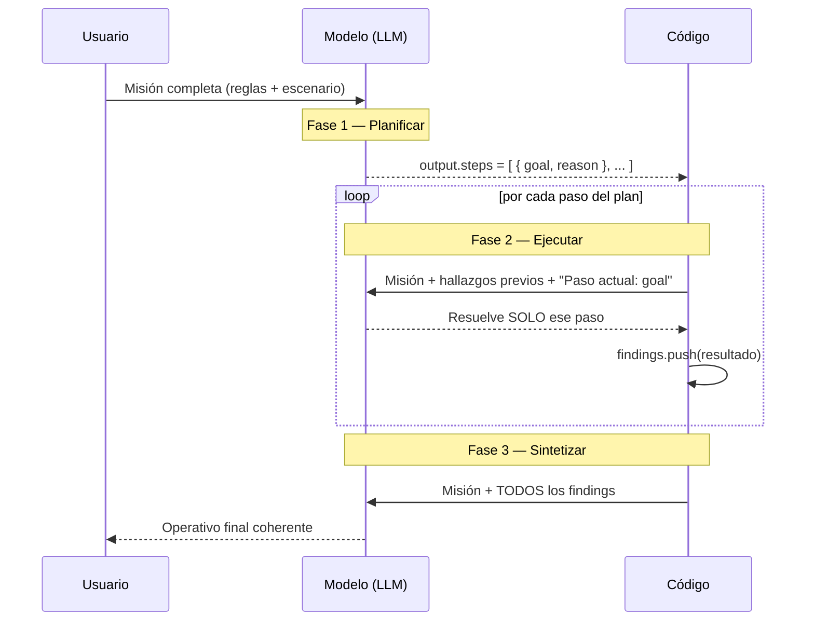

# Patrón Agéntico: Planning (Planificación)

> Ubicación del código: [`planning.ts`](./planning.ts)

En esta sección vemos el segundo patrón agéntico, **"Planning"**: en vez de
pedirle al modelo que resuelva un problema complejo de un solo golpe
("one-shot"), primero le pedimos que lo descomponga en pasos ordenados, y
luego resolvemos ese problema paso a paso, arrastrando lo ya resuelto de una
llamada a la siguiente.

### Temas puntuales

- Salidas estructuradas con Zod (`output: Output.object({ schema })`).
- Descomposición de un problema en pasos (`buildPlan`).
- Ejecución secuencial con memoria a corto plazo (`findings`).
- Síntesis de resultados parciales en una respuesta final.
- Comparar el enfoque "one-shot" contra el enfoque planificado.

## ¿Qué problema resuelve?

Un LLM predice texto: cuando le das un problema con **varias restricciones
cruzadas** (prioridades, recursos limitados, dependencias entre pasos), tiende
a intentar resolverlo todo en un solo intento y, en el camino, "pierde"
alguna regla. En el escenario de este archivo (7 villanos fugados, 5 héroes
con horas limitadas) eso se traduce en errores como:

- Asignar un héroe que no contrarresta el poder real del villano.
- Pasarse de las horas disponibles de un héroe.
- Capturar villanos en el orden equivocado (ignorando la prioridad de
  amenaza, o dejando que un villano libere a los demás antes de neutralizarlo).

Esto pasa incluso con modelos muy capaces: no es un problema de
"inteligencia", sino de que resolver **todo de un tirón** no deja espacio
para verificar cada restricción por separado.

El patrón **Planning** resuelve esto separando el trabajo en fases: primero
**planificar** (qué pasos hay que dar y en qué orden), después **ejecutar**
cada paso de forma aislada, y por último **sintetizar** todo en una
respuesta final coherente.

## `Output.object`: forzar una salida estructurada

En [`01-tool-use`](../01-tool-use/README.md) el modelo decidía **cuándo
llamar una función**. Acá la necesidad es distinta: no queremos que ejecute
nada todavía, solo que **devuelva un plan con una forma exacta** que nuestro
código pueda iterar. Para eso, `generateText` (de `ai`, el Vercel AI SDK)
acepta la opción `output`:

```ts
const { output } = await generateText({
  model,
  output: Output.object({ schema: planSchema }), // fuerza la forma de la respuesta
  prompt: MISSION,
  instructions: '...',
});

output.steps; // ya viene tipado y validado según planSchema
```

- Sin `output`, `generateText` devuelve `text` (texto libre) — hay que
  parsearlo a mano si se espera una estructura, y el formato puede variar de
  una respuesta a otra.
- Con `output: Output.object({ schema })`, la respuesta se valida contra un
  esquema de [Zod](https://zod.dev) y llega ya como un objeto tipado en
  `output`. Es la misma idea que el `inputSchema` de una `tool()`, pero
  aplicada a la **salida** de la llamada en lugar de a los argumentos de una
  función.

## Idea central: 3 fases



Un detalle clave: **cada llamada a `generateText` es independiente**, el
modelo no recuerda nada de la llamada anterior (las APIs de LLM son
*stateless*). Por eso:

- La `MISSION` completa (reglas incluidas) se reenvía en cada fase.
- Los resultados de pasos anteriores (`findings`) se reenvían explícitamente
  en cada iteración de la Fase 2 — es la única forma en que el modelo "sabe"
  qué ya se resolvió.

## Ejemplo en este archivo

`planning.ts` compara dos escenarios sobre la misma `MISSION` (recapturar 7
villanos fugados con 5 héroes de horas y especialidades limitadas):

- **`withoutPlanning()`**: una sola llamada a `generateText` con la misión
  completa, sin `output` estructurado. Es el caso de control (baseline):
  el modelo intenta resolver todo de una vez y hay que revisar a mano si
  respetó las reglas.
- **`withPlanning()`**: aplica el patrón completo en sus 3 fases (`buildPlan`
  + loop de ejecución + síntesis), descritas abajo.

`planningMain()` ejecuta el caso "con planificación" (el caso "sin
planificación" queda comentado, pero se puede activar para comparar ambos
resultados lado a lado con `console.table`, igual que en `01-tool-use`).

### El esquema del plan (`planSchema`)

```ts
const planSchema = z.object({
  steps: z.array(
    z.object({
      goal: z.string().describe('Qué resuelve este paso, en una frase'),
      reason: z.string().describe('¿Por qué es necesario? y ¿Por qué va en esta posición?'),
    }),
  ).min(2).max(15),
});
```

- Se envuelve en un objeto (`{ steps: [...] }`) en vez de dejar un array
  suelto, por la misma razón que en `01-tool-use`: es más fácil de extender
  después (ej. agregar `estimatedHours` a nivel del plan) sin romper el
  contrato.
- Pedir `reason` no es decorativo: obliga al modelo a **justificar el
  orden** de cada paso (ej. "va primero porque libera a los demás si no cae
  ya"), lo que reduce la probabilidad de que arme una secuencia arbitraria.
- `.min(2)` evita un "plan" de un solo paso (eso no sería planificar nada);
  `.max(15)` es un techo defensivo para no disparar un plan desproporcionado
  en pasos (y, en consecuencia, en llamadas y tokens de la Fase 2).

### Fase 1 — Construir el plan (`buildPlan`)

El modelo actúa como **estratega, no como ejecutor**. Sus instrucciones son
explícitas en frenarlo: *"NO resuelvas el operativo todavía... solo
decompónlo en pasos ordenados"*. La salida se fuerza con
`output: Output.object({ schema: planSchema })`, así que `buildPlan()`
devuelve directamente `output.steps`, listo para iterar con un `for...of` en
la Fase 2.

### Fase 2 — Ejecutar paso a paso

```ts
for (const [index, step] of steps.entries()) {
  const { text } = await generateText({
    model,
    instructions: 'Resuelve únicamente el paso indicado. No te adelantes...',
    prompt:
      `Misión original: ${MISSION}\n\n` +
      (findings.length ? `Resuelto hasta ahora: ${findings.join('\n----\n')}\n\n` : '') +
      `Paso actual: ${step.goal}`,
  });

  findings.push(`[ ${step.goal} ]\n ${text.trim()}`);
}
```

- **Una llamada a `generateText` por cada paso del plan.**
- Las `instructions` ("resuelve únicamente el paso indicado... no des el
  operativo final") son el freno que evita que el modelo, por su tendencia
  natural a "completar" texto, se adelante y entregue la solución completa en
  el primer paso — lo cual anularía todo el propósito de planificar.
- `findings` es la **memoria a corto plazo** del agente: como cada llamada es
  stateless, es el único mecanismo para que el modelo sepa qué ya se decidió
  en pasos anteriores (ej. que un héroe ya fue asignado) y no lo repita ni lo
  contradiga.
- El `"Paso actual: ${step.goal}"` se manda **siempre**, en todas las
  iteraciones — lo único que cambia es si ya hay `findings` previos que
  agregar como contexto extra.

### Fase 3 — Sintetizar

Durante la Fase 2 el modelo resolvió "a ciegas", un paso a la vez, sin ver el
panorama completo. La síntesis junta **todos** los `findings` en un único
prompt final para que el modelo redacte el operativo definitivo, coherente,
en vez de que el resultado quede como una simple concatenación de respuestas
parciales.

## Buenas prácticas que ejemplifica este código

| Práctica | Dónde se ve | Por qué importa |
|---|---|---|
| Salida estructurada en vez de texto libre | `Output.object({ schema: planSchema })` en `buildPlan` | Permite iterar el plan con código normal (`for...of`), sin parsear texto ambiguo |
| Reenviar el contexto en cada llamada | `MISSION` + `findings` en cada iteración de la Fase 2 | Las llamadas a LLM son *stateless*; sin esto el modelo "olvida" reglas y pasos anteriores |
| Frenar explícitamente el adelantamiento | `instructions` de la Fase 2 ("no te adelantes...") | Los LLM tienden a completar la tarea entera; hay que decirles que se detengan en el paso actual |
| Justificar el orden (`reason`) | Campo `reason` en `planSchema` | Reduce que el plan salga con un orden arbitrario, al obligar a razonar la posición de cada paso |
| Fase de síntesis separada de la ejecución | `withPlanning()`, Fase 3 | La ejecución paso a paso es "ciega"; la síntesis es el único momento donde el modelo ve el panorama completo |
| Trazabilidad (`tracer`) | `createTracer(...)` + `onStepEnd` en las 3 fases | Permite ver, de principio a fin, cuántas llamadas se hicieron y qué costó cada una en tokens |

## El costo de planificar

```
Planificar cuesta más llamadas y más tokens.
Lo que compra es que las restricciones sobrevivan hasta el final.
Si no hay restricciones que perder, no compra nada.
```

Un plan de *N* pasos implica, como mínimo, *N + 2* llamadas al modelo (1
para planificar, *N* para ejecutar, 1 para sintetizar) frente a la única
llamada de `withoutPlanning()`. Eso multiplica la latencia y el consumo de
tokens. La razón para pagar ese costo es que las restricciones del problema
sobrevivan de principio a fin — si el problema no tiene restricciones que
perder (una pregunta simple, sin pasos dependientes), planificar no aporta
nada y conviene ir directo con un `generateText` simple, como en
[`01-tool-use`](../01-tool-use/README.md).

## El `tracer`

Igual que en `01-tool-use`, `createTracer(label)` (en
`src/helpers/create-tracer.ts`) engancha `onStepEnd` de `generateText` para
imprimir, en cada una de las 3 fases, qué se generó y cuántos tokens costó.
`tracer.summary()` devuelve `{ steps, totalTokens }`, que es lo que se
muestra en el `console.table` de `planningMain()`.

## Cómo correr el ejemplo

En `src/main.ts`, asegúrate de que la línea activa sea:

```ts
await planningMain();
```

Al ejecutarlo (`npm run dev`) verás en consola:

1. El plan generado en la Fase 1 (`Steps:`).
2. El progreso de la Fase 2, paso por paso (`--> Ejecutando paso N: ...`).
3. Los `findings` acumulados.
4. El "Operativo final" de la Fase 3.
5. Una tabla comparativa con pasos y tokens usados.

Para comparar contra el caso sin planificación, descomenta en
`planningMain()`:

```ts
const a = await withoutPlanning();
// ...
console.table({
  'Sin planificación': a,
  'Con planificación': b,
});
```

y verás cómo, sin planificación, el modelo resuelve todo en 1 solo paso (sin
poder verificar cada restricción por separado), mientras que con
planificación toma varias llamadas pero cada restricción se puede rastrear
hasta el paso que la resolvió.

## Preguntas y respuestas (autoevaluación)

**1. ¿Cuál es la principal razón por la que el patrón "Planning" (Planeación)
supera al enfoque tradicional de "one-shot prompt" al enfrentarse a
problemas con múltiples restricciones?**

Porque al descomponer el problema en pasos lógicos estructurados, evita que
el modelo pierda el rastro de las restricciones y alucine. Los modelos
(incluso los más avanzados) tienden a fallar si intentan procesar muchas
reglas de un solo golpe. Planificar en pasos les da un "espacio para pensar"
y estructurar la solución antes de ejecutarla.

**2. Durante la Fase 1 ("Construcción del plan"), ¿por qué se utiliza la
propiedad `output` con un esquema estructurado (Zod) en lugar de solicitar
simplemente un texto plano (`text`) al modelo?**

Para forzar al modelo a devolver un arreglo de objetos estrictamente
formateado (pasos), facilitando su iteración posterior mediante código. Al
definir un esquema (`z.array` de `z.object`), garantizamos que el modelo
devuelva los datos con propiedades exactas (como `goal` y `reason`), lo que
permite que nuestro código itere sobre ellos de manera predecible mediante
un ciclo `for...of`.

**3. En la Fase 2 ("Ejecutar paso por paso"), ¿cuál es el objetivo primordial
de incluir en las instrucciones la frase: "Resuelve únicamente el paso
indicado. No te adelantes a los siguientes pasos…"?**

Prevenir que el modelo intente deducir la solución final de manera
prematura, lo cual anularía por completo el propósito de evaluar el
problema por partes. La naturaleza de los LLMs es predecir y completar
textos. Si no se les frena, intentarán dar la conclusión final de
inmediato, saltándose el análisis metódico que el patrón Planning intenta
forzar.

**4. Al iterar cada paso del plan, ¿por qué es indispensable pasarle al
modelo el arreglo de hallazgos previos (`findings`) bajo la etiqueta
"Resuelto hasta ahora"?**

Para que el modelo sepa qué acciones y deducciones ya se han realizado,
manteniendo la coherencia lógica y evitando repetir o contradecir tareas.
Como cada petición a la IA es "stateless" (sin estado o memoria entre
llamadas), inyectar los `findings` funciona como la memoria a corto plazo
del agente, permitiéndole construir su razonamiento sobre lo que ya
resolvió en los pasos previos (por ejemplo, saber que un villano ya fue
asignado).

**5. ¿Cuál es el propósito principal de la fase de "Sintetizar pasos
anteriores" (Fase 3) al implementar el patrón de planeación?**

Consolidar todas las deducciones parciales (`findings`) enviándolas en una
última petición para que la IA evalúe el panorama completo y redacte la
conclusión definitiva. Durante la iteración (Fase 2) el agente resolvió el
problema a ciegas paso a paso. En la fase de síntesis, toma todos esos
"pedazos del rompecabezas" ya armados y da un dictamen coherente (por
ejemplo, afirmar con seguridad si el plan es viable o no).

**6. En términos de rendimiento operativo, ¿cuál es la principal desventaja
al aplicar el patrón "Planning" comparado con realizar un "one-shot prompt",
como se demostró en la comparativa de resultados?**

Que el consumo de tokens y el tiempo de espera (latencia) se incrementan
drásticamente debido a los múltiples llamados secuenciales necesarios al
LLM. La principal limitante de este patrón es el costo. Dividir una
petición en un plan de 10 pasos requiere hacer al menos 12 llamadas a la
API (1 para planear, 10 para ejecutar, 1 para sintetizar), lo que
multiplica exponencialmente el consumo de tokens y el tiempo de respuesta.

**7. Verdadero o Falso: Si se utiliza un modelo de inteligencia artificial de
vanguardia con alta capacidad de razonamiento (como Claude Opus), se
garantiza que un simple "one-shot prompt" será suficiente para respetar
perfectamente todas las restricciones complejas de un problema lógico,
haciendo que el patrón de planeación sea siempre innecesario.**

Falso. Como se demostró en la lección, aunque Claude Opus reconoció que el
plan era viable, en su ejecución "one-shot prompt" falló al alterar el
orden de prioridad de ciertos factores críticos. El patrón de planeación
fue necesario incluso para el modelo más fuerte para garantizar el 100% de
apego a las reglas.

## Errores comunes a evitar

- **Olvidar reenviar el contexto en cada llamada**: como cada `generateText`
  es independiente, no repetir `MISSION` y `findings` en cada paso hace que
  el modelo "olvide" reglas o hallazgos previos.
- **No frenar el adelantamiento del modelo**: sin una instrucción explícita
  de "resuelve solo este paso", el modelo suele intentar resolver el
  operativo completo desde el primer paso.
- **Pedir texto libre cuando se necesita iterar la respuesta con código**:
  sin `output: Output.object({ schema })`, parsear un plan desde texto plano
  es frágil (el formato puede variar entre respuestas).
- **Construir el prompt con lógica condicional descuidada**: en una versión
  anterior de este archivo, el texto `"Paso actual: ${step.goal}"` solo se
  incluía en el *primer* paso por un operador ternario mal formado
  (`cond ? A : '' + B` en vez de `(cond ? A : '') + B`), así que a partir del
  segundo paso el modelo dejaba de recibir cuál era el paso a resolver. Hay
  que revisar con cuidado la precedencia de operadores al construir prompts
  con concatenación condicional.
- **Planificar cuando no hace falta**: si el problema no tiene restricciones
  que puedan perderse en el camino (una pregunta simple y directa),
  planificar solo agrega latencia y costo sin ningún beneficio.
